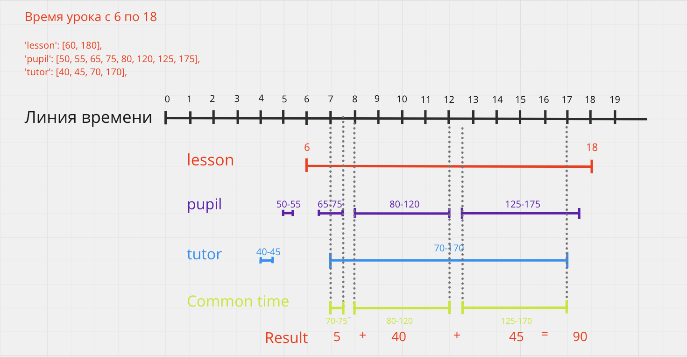

<h1 align="center">
  Find pupil & tutor lesson time
</h1>
<hr>

<p align="center">
  <a href="#test-assignment">Test assignment</a> •
  <a href="#tech-stack">Tech stack</a> •
  <a href="#how-to-run-tests">How to run tests</a> •
  <a href="#additional-material">Additional material</a>
</p>

## Test assignment
[test assignment](task3.md)

## Tech stack
- [Python 3.11](https://www.python.org/downloads/)


## How to run tests

1. Move to working dir
   ```bash
   cd test3
   ```

2. Run script
   ```bash
   python solution.py
   ```

3. Run tests
   ```bash
   python -m test_solution -v
   ```
   
## Additional material


<br>
<br>
<p align="center">
  <a href="https://github.com/mrKazzila">GitHub</a> •
  <a href="https://mrkazzila.github.io/resume/">Resume</a> •
  <a href="https://www.linkedin.com/in/i-kazakov/">LinkedIn</a>
</p>